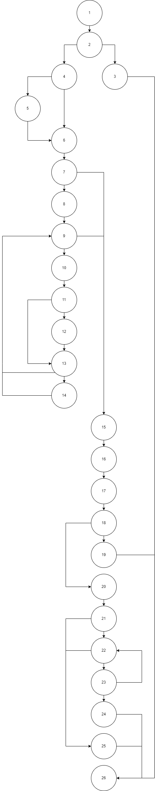

# SI LAB
Марко Стојановиќ 213108

# Control Flow Graph

# Цикломатска комплексност
Цикломатската комплексност е 11 што ја добивме со претсметување на регионите на Control Flow Graphата

# Every branch
1. username = null.
2. username = "Marko", password = null, email = markostojanovikj@gmail.com.
3. username = "Marko", password = Orangutan23, email = null.
4. username = null, password = Orangutan23, email = markostojanovikj@gmail.com.
5. username = "Marko", password = Orangutan23, email = markostojanovikj@gmail.com.
6. username = "Marko", password = Orangu, email = markostojanovikj@gmail.com.
7. username = "Marko", password = Orangutan23@, email = markostojanovikj@gmail.com.
8. username = "Marko", password = Orangutan 23, email = markostojanovikj@gmail.com.

# Multiple condition
1. user = null, X , X
2. user != null, user.getpassword = null, X
3. user != null, user.getpassword != null, user.getemail = null
4. user != null, user.getpassword != null, user.getemail != null